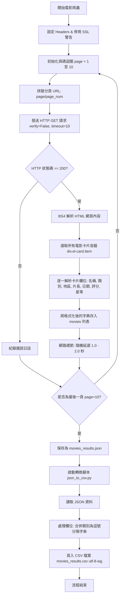

# 電影爬蟲工作流程與架構圖 (Movie Scraper Workflow)

本文件描述了 `crawl_movies.py` 與 `json_to_csv.py` 的協作工作流程，並展示了整個資料管線 (Data Pipeline) 的設計。

---

## 1. 工作流程圖 (Workflow Chart)

以下為電影爬蟲與資料轉換的 Mermaid 工作流程圖：



---

## 2. 詳細運作步驟 (Execution Steps)

1. **環境配置與安全繞過**：
   由於目標網站的 SSL 證書已過期，爬蟲啟動後首先會透過 `urllib3.disable_warnings` 關閉不安全連線的安全警告，並在請求中加入 `verify=False`，防止 SSL 連線階段發生中斷。
2. **翻頁控制（外層迴圈）**：
   遍歷頁碼 `1` 到 `10`，按順序爬取。每一次翻頁請求發送後，會依據「網路禮節」調用 `random.uniform(1.0, 2.0)`，暫停 `1` 至 `2` 秒，降低目標網站伺服器的壓力。
3. **資料定位與提取（內層迴圈）**：
   在單個頁面中，透過 CSS 選擇器 `div.el-card.item` 定位到每一個獨立的電影卡片，並應用 BeautifulSoup 的 `select` 語法提取特定標籤的純文字（如電影名稱、評分等）或屬性值（如 `el-rate` 中的 `aria-valuenow`）。
4. **輸出 JSON**：
   將所有 100 部電影的結構化資料儲存至 `movies_results.json`，提供給機器學習或後續 API 使用。
5. **轉換與 Excel 相容優化**：
   透過 `json_to_csv.py` 讀取 JSON。由於 Excel 在 Windows 系統下開啟 UTF-8 編碼的 CSV 容易產生中文字體亂碼，程式在開啟 CSV 時強制使用了 `utf-8-sig` (即帶有 BOM 的 UTF-8)，使得產出的 `movies_results.csv` 能在 Microsoft Excel 中被直接雙擊正確開啟。

---

## 3. AI 智慧對話與防護控制流程 (AI Chat & Logic Flow)

```mermaid
graph TD
    A[使用者點選開啟對話視窗] --> B{檢查是否啟用 API?}
    B -->|是| C[讀取 localStorage 中的 API 設定]
    C --> D[組合 System Prompt 並移除 100 部電影限制]
    D --> E[依據選擇的服務商 (OpenAI/Gemini/OpenCode) 發送 API 請求]
    E --> F{連線成功?}
    F -->|是| G[重置錯誤計數，渲染 Bot 回覆並儲存對話歷史]
    F -->|否| H[顯示連線錯誤並累計錯誤次數]
    B -->|否| I[啟動無 API 本地特徵配對模式]
    I --> J{輸入包含電影特徵?}
    J -->|是| K[重置錯誤計數，輸出本地推薦結果]
    J -->|否| L[提示使用者輸入特徵或連接 API，累計錯誤次數]
    H --> M{錯誤次數 >= 3?}
    L --> M
    M -->|是| N[鎖定對話框 15 秒並顯示倒數]
    N --> O[15秒後解鎖並重置錯誤]
    M -->|否| P[等待下一次輸入]
    G --> P
    K --> P
```

### 詳細對話邏輯說明：
1. **多 API 架構與本地儲存**：
   對話介面新增了設定面板，允許使用者隨時切換服務商 (OpenAI、Gemini、OpenCode)。所有的 API 金鑰與端點皆安全儲存於使用者的瀏覽器 `localStorage` 中，確保隱私。
2. **無 API 特徵配對機制 (Fallback)**：
   當使用者未啟用 API 時，系統會透過程式拆分 `moviesData` 中的「中/外文名稱」，並比對地區與類型。若使用者發言擊中這些特徵，則自動進行本地電影推薦。
3. **錯誤防禦與鎖定 (Lockout Mechanism)**：
   無論是 API 斷線，或是無 API 模式下輸入了無關字詞，都會被記為一次「錯誤」。當連續錯誤達 3 次，系統會將輸入框鎖死 15 秒，並呈現倒數計時，避免連續發送無效請求。
4. **專屬腦袋引導解除 (Guardrails Lifted)**：
   一旦使用者啟用並成功連接 API，System Prompt 就不再嚴格限制只能討論 100 部高分電影。AI 將保持夏日海灘風格，但能自由回答任何問題。
